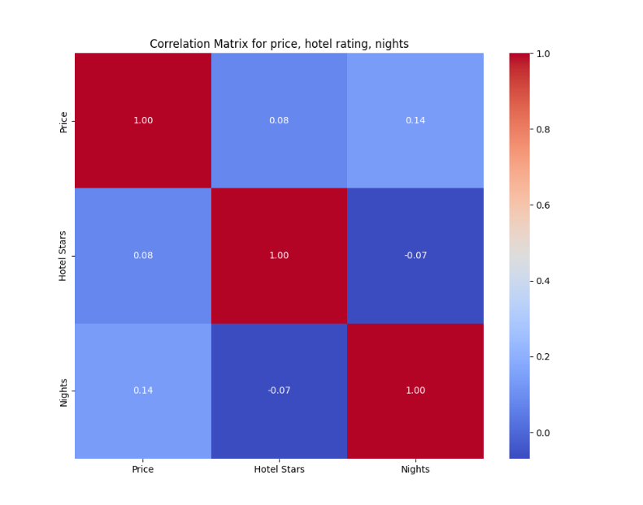

# TRAVEL SITE (Makalius, Novaturas) LAST MINUTE DEALS ANALYSIS

## Details
Created by: Deividas Verbickas and Justė Petrėnė

This is the end project in Vilnius Coding School

## Project theme: Last minute travel deal data analysis and visualization

The main goal of the project is to find out the price differences by different last minute travel providers.

In this project we used Python and CSV files showcasing our practical coding skills acquired at Vilnius Coding School.

## Applied knowledge:
Used libraries: BeautifulSoup, Pandas, MatplotLib, SeaBorn, Selenium

makalius_scraper.py

Getting data from URL: https://www.makalius.lt/paskutine-minute

novaturas_scraper.py

Getting data from URL: https://www.novaturas.lt/paskutine-minute

deals_comparison.py

Merging all csv file data into one csv file deals_comparison.csv. This is the main project file where all analysis were made. All visuals are controlled by functions, which helps to separate all graphs in the code.

## Results

Function price_avg_per_provider() provides this graph:

Function price_avg_per_country() provides this graph:

Function grouped_egypt_by_season_and_provider() provides this graph:

Correlation Matrix for price, hotel rating, season, nights:

## Conclusion

An analysis of the Last Minute Travel Offers shows that the site "Makalius" provides the most expensive offers. Next graph clearly shows that the most expensive last minute offer is to the Caribbean Islands, Mauritius Islands and The Dominican Republic. This is likely influenced by the distance, trip duration and means of transport to locations mentioned before. The last graph shows a that Last Minute Travel Offers are cheapest during the winter season, most likely due to cooler temperatures in all continent of the world (except Australia, which wasn't one of the offers).
